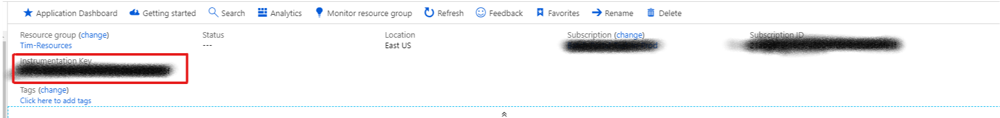

# batch-insights

## Usage
Set 2 environment variables in your start task
 * `APP_INSIGHTS_ACCOUNT`: This is your app insight application id


 * `APP_INSIGHTS_KEY`: This your app insight instrumentation key



### Ubuntu
Add this command in your start task commandLine
```bash
/bin/bash -c 'wget  -O - https://raw.githubusercontent.com/timotheeguerin/batch-insights/master/ubuntu.sh | bash'
```

### Centos
Add this command in your start task commandLine
```bash
/bin/bash -c 'wget  -O - https://raw.githubusercontent.com/timotheeguerin/batch-insights/master/centos.sh | bash'
```
### Windows

```batch
cmd /c @"%SystemRoot%\System32\WindowsPowerShell\v1.0\powershell.exe" -NoProfile -InputFormat None -ExecutionPolicy Bypass -Command "iex ((New-Object System.Net.WebClient).DownloadString('https://raw.githubusercontent.com/timotheeguerin/batch-insights/master/windows.ps1'))"

```
### Generic
If you already have a version of python installed you just need to download `nodestats.py` and install dependencies
You can add this to your main script
```
pip install psutil python-dateutil applicationinsights
wget --no-cache https://raw.githubusercontent.com/timotheeguerin/batch-insights/master/nodestats.py
python --version
python nodestats.py > node-stats.log 2>&1 &
```