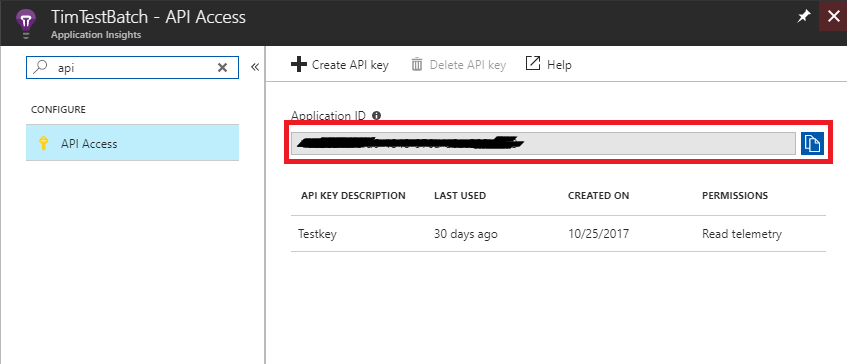

# batch-insights

## Usage
Set 2 environment variables in your start task.  Make sure this is set as a Batch environment variable rather than exporting before running the `nodestats.py` script.  Without the Batch environment variable it will not show up in Batch Labs.
 * `APP_INSIGHTS_APP_ID`: This is your app insight application id



 * `APP_INSIGHTS_KEY`: This your app insight instrumentation key


### Ubuntu
Add this command in your start task commandLine
```bash
/bin/bash -c 'wget  -O - https://raw.githubusercontent.com/Azure/batch-insights/master/ubuntu.sh | bash'
```

### Centos
Add this command in your start task commandLine
```bash
/bin/bash -c 'wget  -O - https://raw.githubusercontent.com/Azure/batch-insights/master/centos.sh | bash'
```
### Windows

```batch
cmd /c @"%SystemRoot%\System32\WindowsPowerShell\v1.0\powershell.exe" -NoProfile -InputFormat None -ExecutionPolicy Bypass -Command "iex ((New-Object System.Net.WebClient).DownloadString('https://raw.githubusercontent.com/Azure/batch-insights/master/windows.ps1'))"

```
### Generic
If you already have a version of python installed you just need to download `nodestats.py` and install dependencies
You can add this to your main script
```
pip install psutil python-dateutil applicationinsights
wget --no-cache https://raw.githubusercontent.com/Azure/batch-insights/master/nodestats.py
python --version
python nodestats.py > node-stats.log 2>&1 &
```

## View data

### Option 1: BatchLabs
BatchLabs is a desktop app used to manage, debug and monitor your azure batch accounts. You can download it [here](https://azure.github.io/BatchLabs)
If you followed the getting started instruction batchlabs should show you the statistics for each of your pool.


## Option 2: 
Use the app insights tools to build your own query on the [Azure Portal](https://ms.portal.azure.com/#blade/HubsExtension/Resources/resourceType/microsoft.insights%2Fcomponents)

## Contributing

This project welcomes contributions and suggestions.  Most contributions require you to agree to a
Contributor License Agreement (CLA) declaring that you have the right to, and actually do, grant us
the rights to use your contribution. For details, visit https://cla.microsoft.com.

When you submit a pull request, a CLA-bot will automatically determine whether you need to provide
a CLA and decorate the PR appropriately (e.g., label, comment). Simply follow the instructions
provided by the bot. You will only need to do this once across all repos using our CLA.

This project has adopted the [Microsoft Open Source Code of Conduct](https://opensource.microsoft.com/codeofconduct/).
For more information see the [Code of Conduct FAQ](https://opensource.microsoft.com/codeofconduct/faq/) or
contact [opencode@microsoft.com](mailto:opencode@microsoft.com) with any additional questions or comments.